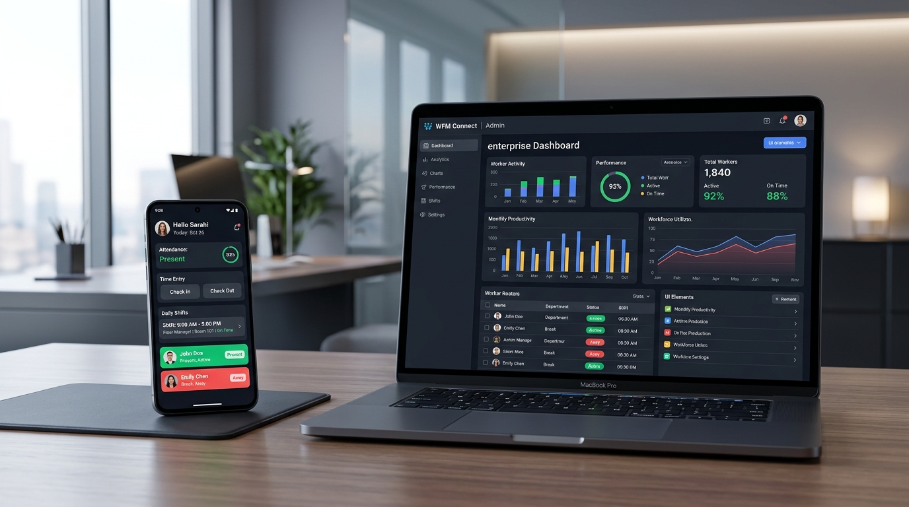
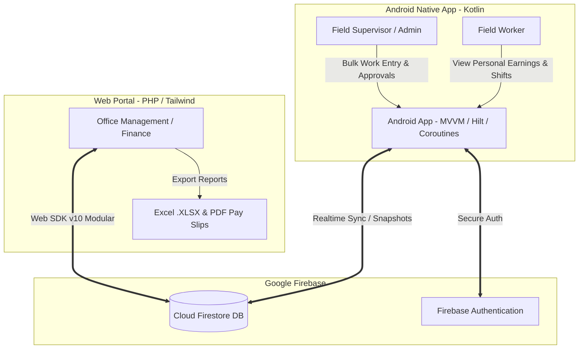
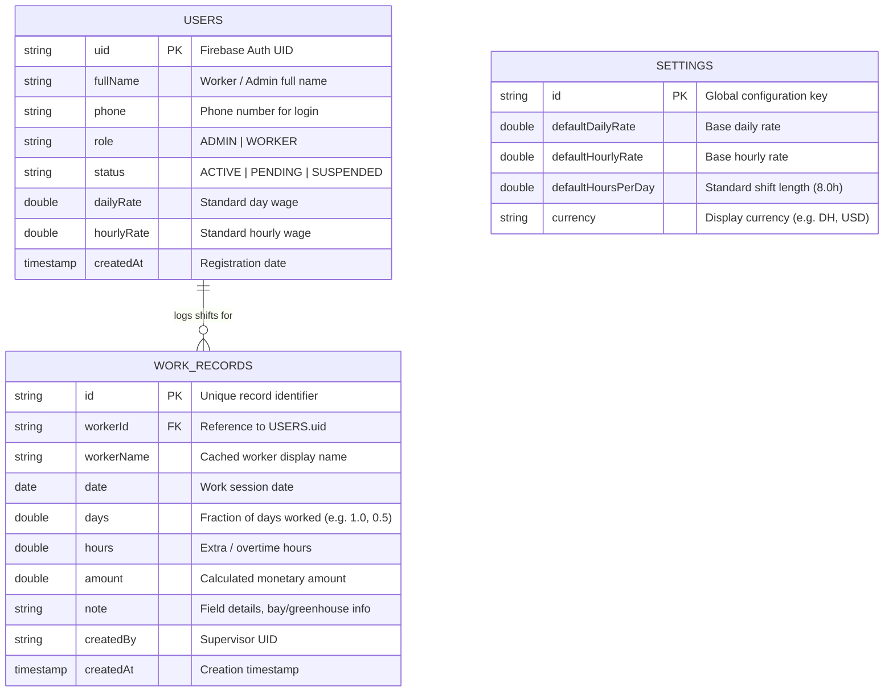

<div align="center">

# 🏢 BIGAAPP — Enterprise Workforce & Wage Management Ecosystem
### *Real-Time Cross-Platform Solution: Native Android App + Cloud Web Admin Portal*

[](https://developer.android.com/)
[](https://kotlinlang.org/)
[](https://developer.android.com/topic/architecture)
[](https://firebase.google.com/)
[](https://www.php.net/)
[](https://tailwindcss.com/)
[](LICENSE)

<br/>



<br/>

**A complete, production-grade enterprise workforce management system designed for agricultural, contracting, and industrial businesses.**  
Eliminates paper timesheets, automates complex piece-rate and daily wage calculations, and synchronizes field supervisors on mobile with headquarters on web in sub-second real time.

[English Overview](#-english-overview) • [Architecture](#-system-architecture) • [Features](#-key-features) • [Database Schema](#-database-schema) • [Installation](#-getting-started) • [ملخص المشروع بالعربية](#-ملخص-المشروع-باللغة-العربية) • [Hire Me](#-hire-the-developer)

</div>

---

## 🎯 Executive Summary & Business Value

Managing field workforces, farm laborers, and shift workers across large facilities has historically caused:
- **Calculation Errors**: Mixing daily rates, hourly wages, and overtime creates manual accounting bottlenecks.
- **Data Desynchronization**: Delays between field supervisors logging hours and management reviewing costs.
- **Ghost Labor & Security Risks**: Unverified workers logging shifts without administrative approval.

**BIGAAPP solves this end-to-end** through a unified cloud ecosystem:
1. **Field Supervisors & Workers** use a high-performance **Native Android App** with instant offline-to-online sync, bulk entry tools, and account verification workflows.
2. **Operations & Finance Managers** use a responsive **Web Administration Dashboard** with real-time financial meters, interactive Chart.js analytics, and one-click export to Excel and PDF.

---

## 🏗️ System Architecture



---

## ✨ Key Features

### 📱 1. Native Android Mobile Application
* **Modern Android Stack**: Built 100% in Kotlin following **Clean Architecture** and **MVVM** principles with `StateFlow` and `SharedFlow`.
* **Dependency Injection**: Powered by **Dagger Hilt** for modular, testable, and maintainable code.
* **Supervisor Bulk Work Entry (`BulkWorkEntryFragment`)**: Log full crews' shifts in seconds with pre-populated worker rows, hours, and daily rates.
* **Dynamic Wage Engine**: Automatically computes total compensations based on configurable models:
  $$\text{Total Amount} = (\text{Days} \times \text{Daily Rate}) + (\text{Hours} \times \text{Hourly Rate})$$
* **Security & Approval Workflow**: New worker registrations default to `PENDING_APPROVAL` status until explicitly authorized by a designated administrator.
* **Reactive Real-time UI**: Built with `callbackFlow` and Firestore snapshot listeners for immediate zero-refresh updates.

### 💻 2. Real-Time Web Administration Portal
* **Live Financial Metrics**: Real-time KPI cards displaying Total Workforce Count, Pending Unpaid Wages, and Accumulated Overtime (HS).
* **Interactive Data Visualization**: **Chart.js** integration displaying dynamic wage distribution across top earners.
* **Workforce Directory & Profile Audits**: Complete list of personnel with status toggling (Active, Pending, Suspended) and granular work history.
* **Automated Export Engine**: Instant client-side generation of:
  - **Excel Sheets (`.xlsx`)** using SheetJS for payroll calculation.
  - **PDF Reports** with print-ready formatting for worker receipts.
* **Responsive Modern UI**: Styled with **Tailwind CSS** and Google Fonts (Cairo) with full RTL Arabic support.

---

## 🗂️ Project Structure

```
BIGAPP/
├── app/                              # Native Android Application (Kotlin)
│   ├── src/main/java/com/hostwaypro/bigapp/
│   │   ├── data/
│   │   │   ├── model/               # Data Entities (User, WorkRecord, AppSettings)
│   │   │   └── repository/          # Repository Pattern implementations
│   │   ├── di/                      # Dagger Hilt Dependency Injection Modules
│   │   ├── ui/
│   │   │   ├── adapters/            # RecyclerView Adapters (Bulk Entry, Records)
│   │   │   ├── fragments/           # UI Screens (Dashboard, Workers, BulkEntry, Reports)
│   │   │   └── viewmodel/           # ViewModels with Coroutines & StateFlow
│   │   └── util/                    # Resource wrappers & Helper utilities
│   ├── src/main/res/                # Layouts, Navigation graphs, Themes & Drawables
│   └── build.gradle.kts             # Android build configuration & dependencies
│
├── admin-panel/                      # Web Administration Portal (PHP & Tailwind)
│   ├── includes/
│   │   ├── auth_check.php           # Session guard & authentication validator
│   │   ├── config.sample.php        # Template configuration file
│   │   ├── firebase_helper.php      # Modular Firebase Web SDK v10 initializer
│   │   ├── header.php               # RTL Sidebar, navigation, and script assets
│   │   └── footer.php               # Core business scripts & data listeners
│   ├── index.php                    # Executive Analytics Dashboard & KPI Cards
│   ├── workers.php                  # Workforce directory & status management
│   ├── worker_details.php           # Granular worker history & timesheet ledger
│   ├── records.php                  # Shift records with Excel & PDF Export
│   ├── admins.php                   # Administrative account permissions
│   ├── settings.php                 # Global rates, hours per day, and currency rules
│   └── login.php                    # Secure portal entry with Firebase Auth
│
├── docs/assets/                     # Architecture diagrams and showcase banners
├── .gitignore                       # Production-grade Git ignore (Zero secret leakage)
├── LICENSE                          # MIT License
└── README.md                        # Master project documentation
```

---

## 📊 Database Schema (Cloud Firestore)



---

## 🚀 Getting Started

### 1. Android Application Setup
1. Clone the repository:
   ```bash
   git clone https://github.com/biga5645/Workforce-Management-System.git
   cd Workforce-Management-System
   ```
2. Open the project in **Android Studio** (Hedgehog or newer recommended).
3. Connect your Firebase project:
   - Copy `app/src/google-services.json.example` to `app/src/google-services.json`.
   - Replace with your actual project keys from [Firebase Console](https://console.firebase.google.com/).
4. Sync Gradle and run on an Android Device or Emulator (API 26+).

### 2. Web Admin Portal Setup
1. Navigate to the `admin-panel` directory:
   ```bash
   cd admin-panel
   ```
2. Setup configuration:
   - Copy `includes/config.sample.php` to `includes/config.php`.
   - Update with your Firebase Web configuration and administrator phone number.
3. Launch with local PHP server or Apache/XAMPP:
   ```bash
   php -S localhost:8080
   ```
4. Navigate to `http://localhost:8080` and log in with your administrator credentials.

---

<div dir="rtl" align="right">

## 🇲🇦 ملخص المشروع باللغة العربية (نظام BIGAAPP لإدارة العمال والأجور)

### ما هو نظام BIGAAPP؟
**BIGAAPP** هو حل برمجي متكامل وسحابي مصمم خصيصاً للشركات الزراعية، مقاولات البناء، والمؤسسات التي تدير فرق عمل ميدانية. يجمع النظام بين:
1. **تطبيق هاتف أندرويد أصيل (Native Android)** للمشرفين والعمال في الميدان لتسجيل الحضور، ساعات العمل، والعمليات اليومية.
2. **لوحة تحكم ويب تفاعلية (Web Admin Panel)** للإدارة والمحاسبة لمتابعة الأجور، تحليل الإنتاجية، وتصدير التقارير بضغطة زر.

### 🌟 أبرز مميزات النظام:
* **تسجيل جماعي سريع للمشرفين (Bulk Work Entry)**: إمكانية تسجيل ساعات وأيام العمل لجميع عمال الورشة أو الضيعة الفلاحية دفعة واحدة دون تكرار.
* **حساب آلي ودقيق للأجور**: يدعم النظام الحساب باليومية (Daily Rate)، بالساعة (Hourly Rate)، أو بالنظام المزدوج، مع احتساب الساعات الإضافية (HS).
* **نظام التحقق والموافقة (Approval Workflow)**: أي عامل جديد يسجل في التطبيق ينتظر موافقة المدير لتفادي أي تسجيل عشوائي.
* **مزامنة فورية (Real-Time Cloud Sync)**: عبر قواعد بيانات Google Cloud Firestore، تظهر بيانات الميدان على لوحة الإدارة خلال أجزاء من الثانية.
* **تصدير كشوفات الأجور**: إمكانية تصدير سجلات العمل مباشرة إلى **ملفات Excel (`.xlsx`)** أو تقارير **PDF** جاهزة للطباعة والتوقيع.

### 💡 التقنيات المستخدمة:
* **تطبيق أندرويد**: لغة Kotlin، معمارية MVVM Clean Architecture، حقن التبعيات Dagger Hilt، ومكتبات Jetpack الحديثة.
* **لوحة التحكم الويب**: PHP 8، Tailwind CSS، Chart.js، ومكتبة Firebase Web SDK v10.
* **الخادم وقواعد البيانات**: Google Firebase (Firestore Database & Firebase Authentication).

</div>

---

## 💼 Hire the Developer / Available for Custom Projects

Looking for a custom enterprise mobile application, web dashboard, or full-stack software tailored to your business needs?

I specialize in building **high-performance mobile apps, real-time cloud systems, and business automation platforms**:
- 📱 **Mobile Development**: Native Android (Kotlin), Cross-platform, Clean Architecture.
- 💻 **Web Applications**: Modern dashboards, PHP/Laravel, Vue/React, Tailwind CSS.
- ☁️ **Cloud & APIs**: Firebase, REST APIs, Microservices, Real-time systems.
- 📊 **Custom ERP / CRM**: Workforce tracking, POS systems, Inventory & Payroll solutions.

### 📬 Get In Touch:
- **Email**: `biga.onee@gmail.com` *(Replace with your professional email)*
- **WhatsApp**: `+212 662564570` *(Replace with your phone/WhatsApp)*
- **GitHub**: [@biga5645](https://github.com/biga5645)

---

## 📄 License

This project is licensed under the [MIT License](LICENSE) — free to use and adapt for personal and commercial projects.
